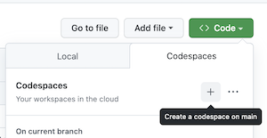
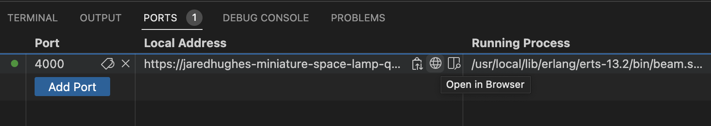
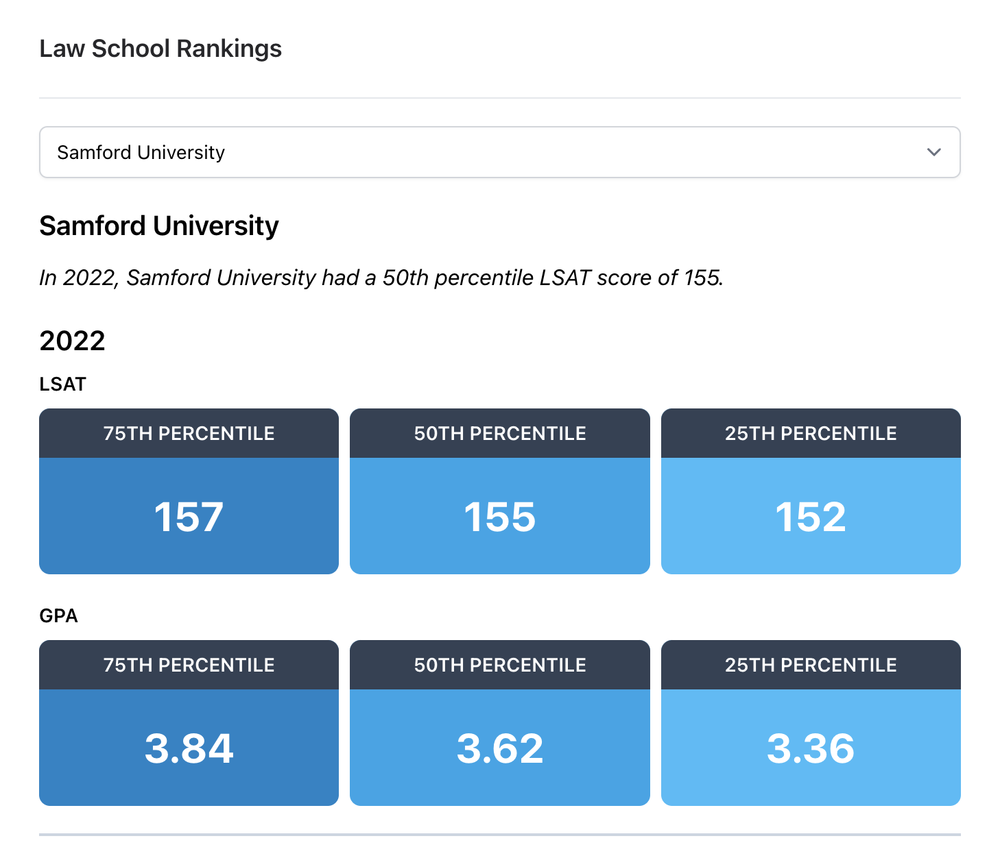

# Law School Rankings

> This project was scaffolded using [nicbet/docker-phoenix](https://github.com/nicbet/docker-phoenix) via [Degit](https://github.com/Rich-Harris/degit).

## Prerequisites

This project requires:
* [Visual Studio Code](https://code.visualstudio.com/)
* [Dev Containers extension](https://marketplace.visualstudio.com/items?itemName=ms-vscode-remote.remote-containers)

Alternatively, you can access the development environment via [GitHub Codespaces](https://docs.github.com/en/codespaces).

## Running the App Container

### With Codespaces

1. Open https://github.com/jaredhughes/law_school_rankings
2. Click "<> Code"
3. Click "Create a codespace on main"

### With VS Code

1. Clone this repository
2. `cd law_school_rankings && code .` to open the repo root in VS Code
3. When asked, select "Reopen in container"

## Setup

With the container running, open the VS Code Terminal (it will have attached to the container session) and execute the following:

1. `mix deps.get`: Install Elixir dependencies
2. `mix ecto.create`: Create Postgres Database
3. `mix ecto.migrate`: Apply data model to new database
4. `mix run priv/repo/seeds.exs`: Seed database from CSV provided for project
5. `iex -S mix phx.server`: Run the Phoenix application

Locally, the application will be running at `localhost:4000/`.

In Codespaces, open the Ports tab in the terminal and click the globe icon to open the application in a browser:

